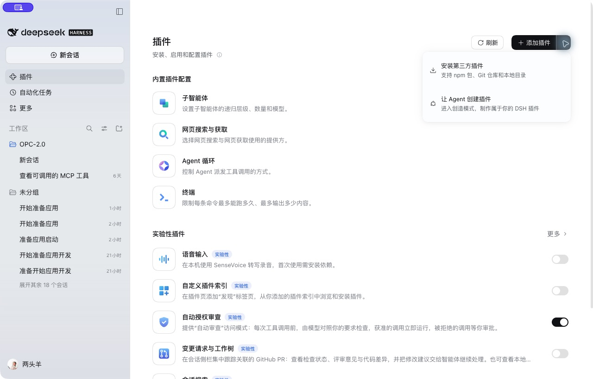
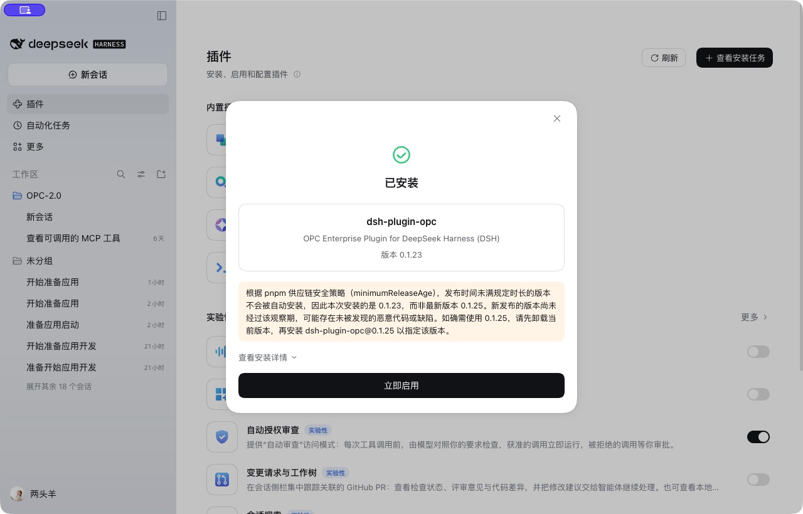
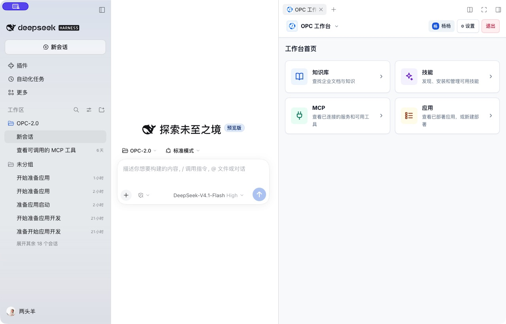
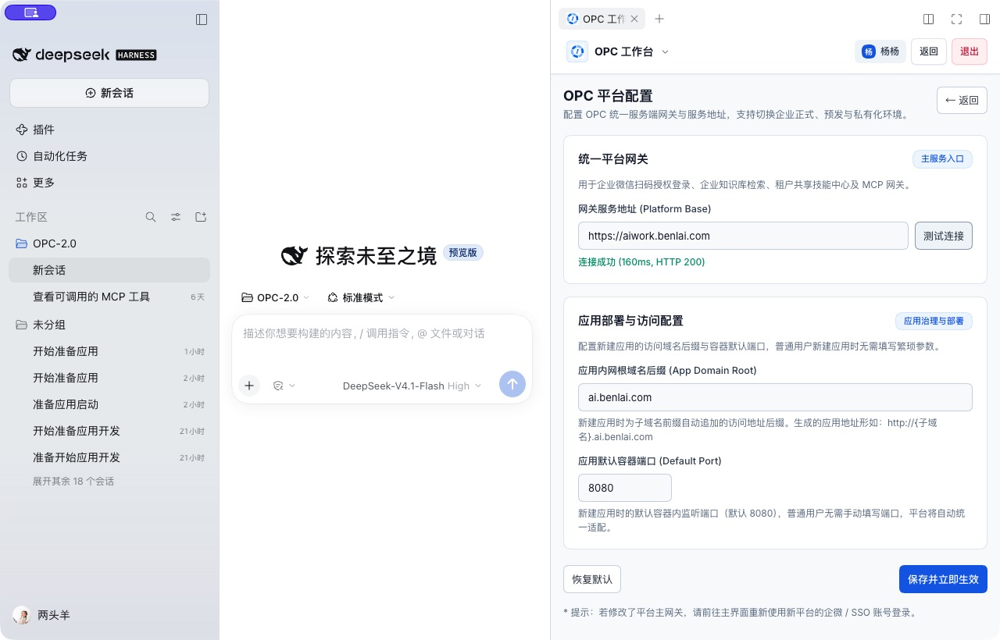
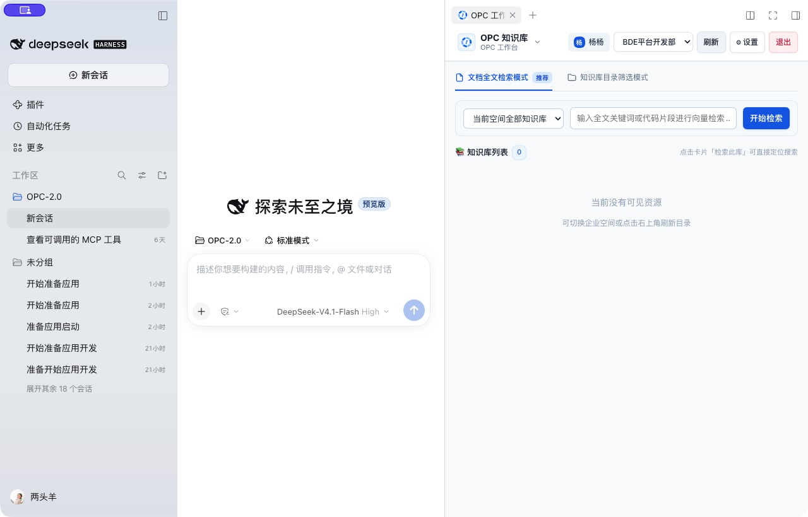
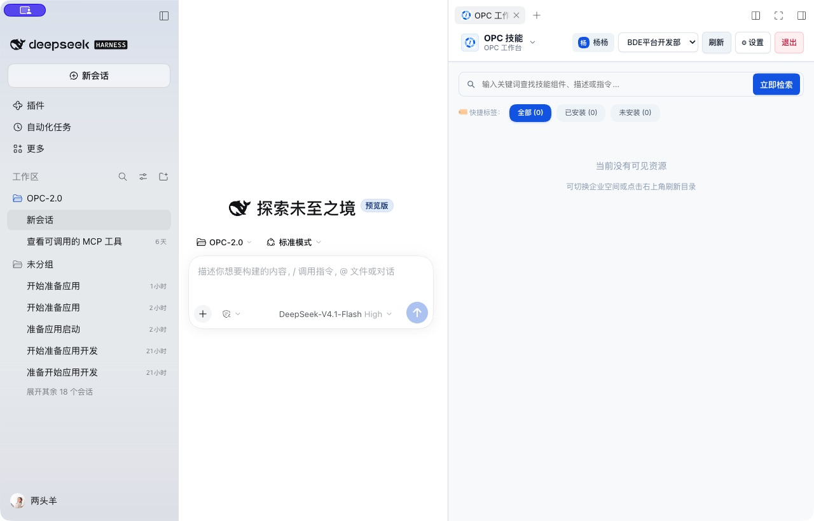

# OPC 插件新手上手指南

通过 DeepSeek Harness（DSH）安装 `dsh-plugin-opc`，在右侧打开 **OPC 工作台**，即可进入企业知识库、技能、MCP 和应用。首次使用按 **安装插件 → 打开工作台 → 配置网关 → 企业登录 → 选择空间** 的顺序操作。

本文配图于 2026-11-19 从 DeepSeek Harness 桌面客户端重新采集，实装的 OPC 插件版本为 `0.1.23`。企业空间和资源列表以当前账号的授权为准。

| 模块 | 可以做什么 |
| --- | --- |
| 知识库 | 查找企业文档，或在对话中让 AI 根据文档回答 |
| 技能 | 查找、安装和调用已开放的技能 |
| MCP | 查看企业服务和工具，按权限查询业务数据 |
| 应用 | 查看已部署应用，或导入本地源码部署新应用 |

## 一、按包名安装插件

1. 打开 DSH，点击左侧 **插件**，然后点击右上角 **添加插件** 旁的下拉箭头。

   

2. 点击 **安装第三方插件**。

   

3. 在 **包名或地址** 输入 `dsh-plugin-opc`，确认 **安装源** 为 **npm 官方源**，点击 **安装**。

   

4. 等待弹窗显示 **已安装**，然后点击 **立即启用**。以结果弹窗中的版本为准。此次安装器显示新版仍在供应链观察期，按包名实际安装了 `0.1.23`。

   

5. 回到 **插件 → 已安装插件**，确认 `dsh-plugin-opc` 右侧开关已打开。已经装好的用户可在这里直接核对状态。有更新时，插件页会标记 **可更新**。

   

## 二、打开 OPC 工作台

1. 点击左侧 **新会话**，再点客户端右上角的 **打开右侧边栏** 图标。

   

2. 在右侧 **开始** 页点击 **OPC 工作台**。右栏已有该标签时，直接点击 **OPC 工作台** 标签。

   

3. 登录后，工作台首页提供 **知识库、技能、MCP、应用** 四个入口。进入模块后，点击面板左上角的 **当前模块名称及下拉箭头**，可以在同一个标签页内切换模块或返回首页。

   

   

## 三、配置正式网关并登录

1. 在 OPC 工作台点右上角 **设置**。如果还没登录，也可以点登录页上的 **平台设置**。
2. 在 **统一平台网关** 下，把 **网关服务地址 (Platform Base)** 填为 `https://aiwork.benlai.com`。
3. 点击 **测试连接**。看到 **连接成功（HTTP 200）** 后，点击 **保存并立即生效**，再点 **返回**。

   

4. 显示 **连接 OPC 工作空间** 时，点击 **企业微信 / SSO 登录**，在浏览器完成授权后回到 DSH。浏览器关闭时，可点 **重新打开授权页**。如果切换了平台网关，使用新平台的账号重新登录。
5. 在知识库、技能或 MCP 页面，从右上角选择 **企业空间**。如列表未更新，点击 **刷新**。OPC 的企业登录与 DSH 的模型登录是两套设置。在对话里提问时，还需要选择可用的 DSH 模型。

## 四、使用企业知识库

从工作台首页或左上角菜单进入 **知识库**。

- **文档全文检索模式**用于找文档。选择检索范围，输入关键词，点击 **开始检索**。看到结果后点击文档标题，可打开正文。
- **知识库目录筛选模式**用于找库。按库名或描述筛选，在目标卡片上点击 **检索此库**，即可切回全文检索并选定该库。




在 DSH 对话中使用知识库时，输入 `@` 和库名，在 **OPC 知识库** 候选中选中目标库，再继续输入问题。可试问「差旅报销需要准备哪些材料？请列出依据文档的名称」。如需让当前会话持续使用某个库，可在卡片上点 **限定问答范围**，使用完毕后点 **取消限定**。

本次正式环境的测试账号没有可见知识库。在 **当前空间全部知识库** 下尝试检索「报销流程」，客户端显示 `INVALID_REQUEST`。


## 五、安装并使用技能

1. 进入 **技能**，输入技能名称或关键词，点击 **立即检索**。可以用 **全部 / 已安装 / 未安装** 切换列表。
2. 有可用技能时，在技能卡片点 **下载安装**，等待卡片显示 **已启用**。
3. 回到 DSH 对话，输入 `/` 和技能名，从候选中选中它，再描述任务。例如安装了 `excel-compare` 后，输入 `/excel-compare`，上传两份表格并说明按哪一列比对。



## 六、查看并调用 MCP 工具

1. 进入 **MCP**，按服务或工具名称搜索。可用 **全部 / 已连接 / 未挂载** 筛选状态。
2. 在可见服务的卡片上展开 **查看可用工具与调试**，核对工具名、用途和参数。选择已连接的只读工具做第一次查询。
3. 在 DSH 对话里说明要用哪个服务、哪个工具以及查询条件。需要排查单个工具时，可展开 **在线调试调用**，按工具定义输入 JSON，再点 **调用**。查看工具返回中的业务数据或实际错误。若客户端弹出审批，先阅读操作和参数。


如果需要显式调用 `opc_mcp_invoke`，应提供准确的 `service_id`、`tool_name` 和 `arguments`。缺少服务 ID 时，可以向平台管理员查询。

**本次验证范围**：正式网关返回 HTTP 200。在测试账号唯一可选的企业空间内，知识库、技能和 MCP 目录均显示 0 项。已操作三个模块的页面和检索入口，技能安装、MCP 工具调用和知识库问答需要有可见资源的账号才能继续验证。

## 七、常见问题

| 遇到的情况 | 处理方法 |
| --- | --- |
| 安装结果显示的版本比预期旧 | 查看安装器的版本说明。若提示 `minimumReleaseAge`，以安装结果及已安装插件详情显示的版本为准。 |
| 右侧找不到 OPC 工作台 | 核对 **插件 → 已安装插件** 的启用开关，再进入新会话打开右侧边栏。在 **开始** 页仍找不到入口时，完整退出 DSH 后重新打开。 |
| 企业授权页关闭了 | 点 **重新打开授权页**，或取消后重新发起企业登录。 |
| 登录后列表为空，或输入 `@` 找不到库 | 核对右上角的企业空间并刷新。如仍无资源，请管理员确认当前账号的资源授权。 |
| 知识库检索显示 `INVALID_REQUEST` | 确认列表中有可见知识库，选择具体库再检索。如果选库后仍报错，请提供操作时间、空间和错误码供管理员查看。 |
| MCP 返回 `INTEGRATION_ARGS_KEY_REQUIRED` | 把错误码和工具名交给平台管理员排查。 |
| 对话无法发送 | 检查 DSH 是否已选择可用模型，并按客户端提示完成模型登录。 |

## OPC 应用部署

在 **OPC 工作台 → 应用** 打开应用中心，点击 **新建应用**。填写应用名称和访问子域名，选择分析模型，再选择**源码文件夹**或 **ZIP 压缩包**，也可以输入本机完整路径。点击 **创建并开始 AI 分析** 后，AI 在源码副本上分析和提出容器改造。核对改造方案与部署配置后，再确认发布。


可以单独选择改造模型。向导会保存部署配置草稿，并可在发布前预览完整应用技能。服务器启动后，向导自动发起首次业务验证，也可手动检查。应用版本、制品摘要、健康身份和只读业务验证都通过后，在对话框输入 `/app-<应用标识>` 选择技能。纯页面应用需要打开页面并确认。普通 HTTP/JSON 接口可作为技能调用，写操作会触发 DSH 审批。应用卡片可启用或停用本地技能，升级和回滚会保留该设置。

改造阶段会识别应用的登录方式和权限规则。受保护的接口在部署后填写应用账号、密码或现有会话，点击 **仅重试业务验证** 即可复测。默认仅用于本次验证。勾选保存后，通过验证的凭据由 DSH 凭据服务保管，可用于对话调用。

应用创建者可从应用卡片进入 **详情** 或 **版本与回退**，查看日志、版本和存储卷，下载历史制品、单卷备份或整应用备份。平台文件直接保存到运行 DSH 的电脑的下载目录。向导内导出的本地交付包仍有 64 MiB 单文件上限。配置变化后重新验证业务。回滚恢复应用版本和运行配置，保留卷中的业务数据。

需要支持 `/integration/v1/apps` 的 Platform。企微登录后即可部署，所有登录用户共享应用列表。部署资源由 Platform 的 `app_deploy.enterprise_deploy_resources` 配置提供。应用目录和部署任务独立于知识空间。DSH Desktop 使用自带 Python，独立 Web 运行需在 PATH 提供 Python 3.9 或更新版本。

## 给管理员和开发者

插件通过公开接口接入 DSH。企业认证使用独立凭据命名空间，OPC 服务地址由 `platformBaseUrl` 配置。默认域名是 `https://aiwork.benlai.com`。参见[配置示例](config/overlay.example.yml)、[一期验收记录](docs/acceptance-matrix.md)。

## 本地开发

需要 Node.js 24.9 或更高版本、npm，以及一个已安装依赖、生成了 Host/Client 类型和 Web 构建的 DSH 源码目录。以下示例假定两个仓库位于同一父目录：

```sh
npm ci
node scripts/link-dsh.mjs ../deepseek-harness
node scripts/configure-dsh.mjs ../deepseek-harness
npm test
npm run typecheck
npx tsc -p tsconfig.client.json
npm run build
```

链接和类型配置都生成在插件目录内。重新执行 `npm ci` 后需要重新链接。开发时可通过 DSH CLI 的 `web --patch` 加载外部 YAML，把插件入口指向构建后的 `lib/index.js`。OPC 服务域名由 `platformBaseUrl` 配置，默认是 `https://aiwork.benlai.com`。参见[配置示例](config/overlay.example.yml)和[一期验收记录](docs/acceptance-matrix.md)。
